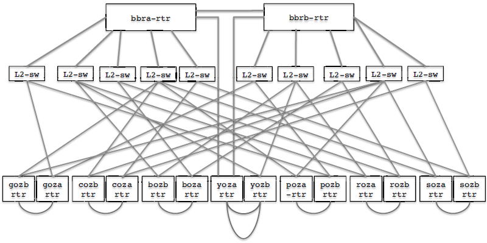

## Overview
Data Plane (Forwarding) Analysis with Neo4j Graph Database.

[Watch demo!](https://www.youtube.com/watch?v=sTlumxzBOmk)

## Instructions

The following instructions have been tested on Ubuntu (16.04, 18.04, 20.04) and Windows.

### Prerequisites

- Docker (19.03)
- Docker-compose (1.26 or 1.27)
- Git Bash (for Windows)

### Build/Run
Open a terminal and issue the following commands:

```bash
git clone https://github.com/amar-ox/dp-analysis-gdb.git
cd smart-network-repository/docker
chmod +x build.sh run.sh
./build.sh
./run.sh
```

## Use DPAnalyzer
When the application starts, it automatically loads an example network and creates the model in Neo4j.

The example network is the Stanford University Backbone Network (see Figure below). 
> "Stanford represents a mid-size enterprise network. 
There are 14 operational zone (OZ) Cisco routers connected via 10 Ethernet switches to 2 backbone Cisco routers that in turn connect Stanford to the outside world. 
Overall, the network has more than 757,000 forwarding entries, 100+ VLANs and 1,500 ACL rules."
> — [P. Kazemian et al.](https://www.usenix.org/conference/nsdi13/technical-sessions/presentation/kazemian)


*Image Source: [P. Kazemian et al.](https://www.usenix.org/conference/nsdi13/technical-sessions/presentation/kazemian)*


To visualize graph schema:
```bash
CALL apoc.meta.graph()
```

Examples are available in the `examples/` folder. 

First generate the forwarding model either using [Java plugin](examples/reachability-java.md) or [Cypher procedure](examples/reachability-cypher.md)

## Contribute

Contributions and feedback are welcome!
